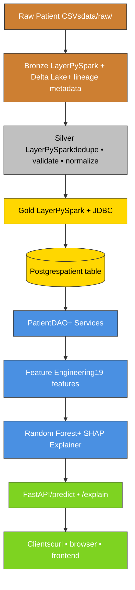

# ReadmitIQ

> Helping clinicians make faster decisions about hospital readmission risk — with explainable ML.

ReadmitIQ is an end-to-end machine learning system that predicts a hospital patient's probability of being readmitted within 30 days of discharge, and explains *why* the model thinks so. It's not a black box: every prediction comes with per-feature contributions a clinician can audit.

The project demonstrates a complete production architecture — data ingestion, model training, explainability, and a REST API — built on the same tools used in healthcare data engineering at scale.

> **Note:** ReadmitIQ is trained on synthetic patient data, not real PHI. The architecture is production-grade; the model is a placeholder a real clinical dataset would replace.

## Why this matters

Under the **CMS Hospital Readmissions Reduction Program**, U.S. hospitals lose up to **3% of their Medicare reimbursements** when their 30-day readmission rates exceed national benchmarks for conditions like heart failure, pneumonia, and COPD. For a mid-sized hospital, that's millions of dollars a year — and worse outcomes for patients who could have been caught earlier.

Predictive models don't replace clinical judgment. They surface risk, with reasoning, before a patient walks out the door — giving the care team a chance to extend a stay, schedule earlier follow-up, or hand off to case management.

## What it does

- **Ingests** raw patient discharge records (CSV) through a Spark medallion pipeline (bronze → silver → gold)
- **Trains** a random forest classifier on the cleaned data, with built-in evaluation against held-out patients
- **Predicts** the probability of 30-day readmission for any new patient
- **Explains** every prediction with SHAP values — which features pushed the risk up, which pulled it down
- **Serves** all of this through a FastAPI REST API with auto-generated documentation

## Architecture



*(The medallion layers are color-coded: bronze, silver, gold. Application stack in blue, API/client layer in green.)*

> **Screenshot placeholders:** Swagger UI at `/docs` and an example `/predict` request will be added here in a future commit.

## Tech stack

| Layer | Technology | Why this choice |
|---|---|---|
| Data ingestion | **PySpark 3.5** + **Delta Lake 3.2** | Industry-standard for medallion architectures; same code runs locally and on production clusters |
| Database | **PostgreSQL 16** (via Docker Compose) | Real RDBMS with constraints, migrations, indexes — not SQLite-as-a-toy |
| Schema migrations | **Alembic** | Versioned, reversible migrations — the schema lives in git |
| ML | **scikit-learn** (Random Forest) | Strong baseline for tabular clinical data; trains fast, calibrates reasonably |
| Explainability | **SHAP** (TreeExplainer) | Per-prediction feature attributions with mathematical guarantees (additivity) |
| API | **FastAPI** + **Pydantic** | Type-validated request/response, auto-generated OpenAPI docs, async-friendly |
| Testing | **pytest** (90 tests) | Unit, integration, and end-to-end coverage across every layer |
| Language | **Python 3.11** | Modern type hints, structural pattern matching, dataclasses |

## Key design decisions

**Medallion architecture, not a single ETL script.** Raw data lands in *bronze* (Delta) with lineage metadata. *Silver* cleans, deduplicates by MRN (latest `ingested_at` wins), and validates ranges. *Gold* loads into Postgres via JDBC. Each layer is independently runnable, testable, and replaceable — a real shop's data engineering shape, not a one-off script.

**Validate-and-null, not filter-and-drop.** When a row's age is out of range or its sex is unrecognized, silver nulls the bad field instead of dropping the row. Rationale: a patient with a missing field is still useful for other analyses. The exception: rows with no MRN are dropped entirely — without a patient ID, the row is fundamentally unusable.

**Explicit JDBC JAR path, not Maven coordinates.** Spark's `spark.jars.packages` is silently ignored when a session already exists in the JVM — a real bug we hit during development. The fix: a downloaded driver JAR at a known path, referenced via `spark.jars`. Surfaces the dependency, eliminates the failure mode.

**Lifespan-managed model loading.** The trained model and SHAP explainer are loaded once at FastAPI startup and stored on `app.state`. Per-request loading would multiply latency 50-100x. The lifespan also fails gracefully — if the model file is missing at startup, `/health` reports `model_loaded: false` instead of crashing the server.

**Column-order tripwire in the predictor.** Feature engineering is the most common silent-failure source in production ML — features arrive in the wrong order, predictions stay valid-looking but wrong. The predictor asserts the column order at inference time and refuses to score if it's been broken. Loud failure beats silent corruption.

**Synthetic data with realistic clinical signal.** The seed script weights diagnoses by real prevalence (heart failure I50.9 ~25%, pneumonia J18.9, COPD J44.9). Readmission rates are conditioned on age, length-of-stay, and diagnosis category. The resulting AUC is intentionally modest — better than chance but far from clinical-grade — which is what an honest synthetic dataset produces.

## Testing strategy

**90 tests across every layer.** Each layer is tested in isolation and end-to-end with the layer it depends on.

| Test layer | Count | What it verifies |
|---|---:|---|
| Config & utilities | 9 | Settings loading, DB connection round-trip, password redaction |
| Data access (DAO) | 8 | CRUD operations, unique constraints, cohort queries |
| Cohort services | 6 | HF/CV/elderly cohort filtering, readmission rate computation |
| Feature engineering | 14 | One-hot mutual exclusivity, column order, edge cases |
| ML training & inference | 6 | Train/eval round-trip, property-based clinical-signal test |
| SHAP explainability | 8 | Additivity guarantee, top-features ranking, clinical sanity |
| API endpoints | 13 | /health, /predict, /explain, validation rejection, lifespan |
| Bronze ingestion | 4 | CSV → Delta, lineage columns, append vs overwrite |
| Silver ingestion | 8 | Dedupe semantics, age/sex validation, MRN filtering |
| Gold ingestion | 8 | JDBC URL parsing, column projection, end-to-end to Postgres |

Property-based tests assert *relationships* rather than specific numbers (e.g., "an 85-year-old with heart failure should score higher than a 35-year-old with a routine admission"). This makes the suite resilient to non-determinism in model training while still catching real regressions.

The test suite runs in **~90 seconds** end-to-end, including a fresh Spark JVM startup, real Postgres writes, and an in-memory FastAPI lifecycle.

## Try it yourself

### Prerequisites

You need these installed before running the project:

- **Python 3.11** (3.10 may work; 3.12+ untested)
- **Docker Desktop** (for the Postgres container)
- **OpenJDK 17** (required by PySpark; `brew install openjdk@17` on macOS)
- `JAVA_HOME` set to your JDK install (`export JAVA_HOME=$(/usr/libexec/java_home -v 17)` on macOS)

### One-command setup

```bash
git clone https://github.com/DevSanjayShah05/readmit-iq.git
cd readmit-iq
./scripts/setup.sh
```

The setup script:
- Creates a Python virtual environment
- Installs all dependencies (`pyproject.toml`)
- Downloads the Postgres JDBC driver
- Starts Postgres via Docker Compose
- Runs Alembic migrations
- Seeds 2,000 synthetic patients
- Trains the model

When it finishes, you're ready to run tests or start the API.

### Run the test suite

```bash
pytest -v
```

Expected: **90 tests pass** in ~90 seconds.

### Start the API server

```bash
uvicorn readmit_iq.api.app:app --reload --port 8000
```

Then open `http://localhost:8000/docs` in your browser for the interactive Swagger UI.

### Try a prediction

```bash
curl -X POST http://localhost:8000/predict \
  -H "Content-Type: application/json" \
  -d '{
    "patients": [
      {
        "mrn": "DEMO-001",
        "age": 78,
        "sex": "M",
        "admission_date": "2024-06-15",
        "discharge_date": "2024-06-22",
        "primary_diagnosis": "I50.9"
      }
    ]
  }'
```

Response shape:

```json
{
  "predictions": [
    {
      "mrn": "DEMO-001",
      "readmission_probability": 0.34,
      "risk_band": "high"
    }
  ]
}
```

Replace `/predict` with `/explain` in the URL to get SHAP feature contributions instead of just the probability.

### Run the full medallion pipeline end-to-end

```bash
# Drop sample CSVs into data/raw/, then:
python -m readmit_iq.ingest.bronze --input data/raw --output data/bronze/patient_raw --mode overwrite
python -m readmit_iq.ingest.silver --bronze data/bronze/patient_raw --silver data/silver/patient_silver
python -m readmit_iq.ingest.gold --silver data/silver/patient_silver --mode overwrite
```

This replaces the Faker-seeded patients with data that flowed through the full Spark medallion.

## Repository layout
readmit-iq/
├── src/readmit_iq/
│   ├── api/              FastAPI app, schemas, /predict and /explain endpoints
│   ├── config.py         Settings (frozen dataclass)
│   ├── dao/              PatientDAO (data access layer)
│   ├── features/         Feature engineering + feature_spec contract
│   ├── ingest/           Bronze, silver, gold Spark pipelines
│   ├── ml/               Train, predict, SHAP explain
│   ├── models.py         Patient domain model
│   ├── scripts/          seed_data (Faker)
│   ├── services/         Cohort service (HF, CV, elderly cohorts)
│   └── utils/            db connection helper, io helpers
├── tests/                90 tests, one per module + integration tests
├── alembic/              Database schema migrations
├── infra/docker/         docker-compose.yml for Postgres
├── scripts/setup.sh      One-command environment setup
├── data/raw/             Sample raw CSVs (gitignored except samples)
└── pyproject.toml        Dependencies + package metadata

## A note on model performance

The AUC on this synthetic dataset varies between ~0.55 and ~0.70 across random seeds — better than chance, far from clinical-grade. This is what an honest synthetic dataset produces. The point of the project is the *architecture* — how a real ML system is structured, tested, and served — not the headline metric.

A production deployment would replace the Faker-seeded patients with a real clinical dataset (e.g., a hospital's discharge records joined with claims data). The bronze/silver/gold layers, the feature engineering, the SHAP explainer, and the API would not change.

## Future work

These tracks are deferred but designed-for:

- **Retrieval-augmented explanations** — a vector database (Qdrant) indexing clinical guidelines, surfaced alongside SHAP at an `/explain-with-citations` endpoint
- **Clinician-facing frontend** — React + TypeScript UI that hits the API and renders predictions with a SHAP bar chart
- **MLOps orchestration** — MLflow for experiment tracking, Airflow DAGs for scheduled medallion runs and model retraining
- **Deployment** — Dockerfile for the API, Kubernetes manifests, observability hooks (Prometheus, OpenTelemetry)

## License & credits

MIT License.

Built by **Dev Shah** — [GitHub](https://github.com/DevSanjayShah05)